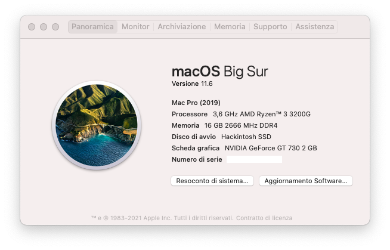
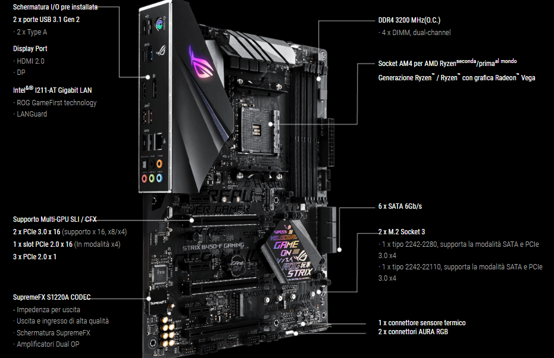
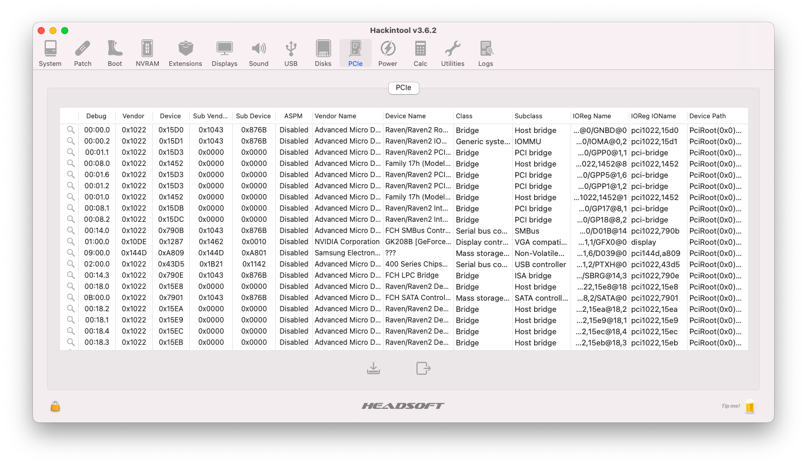
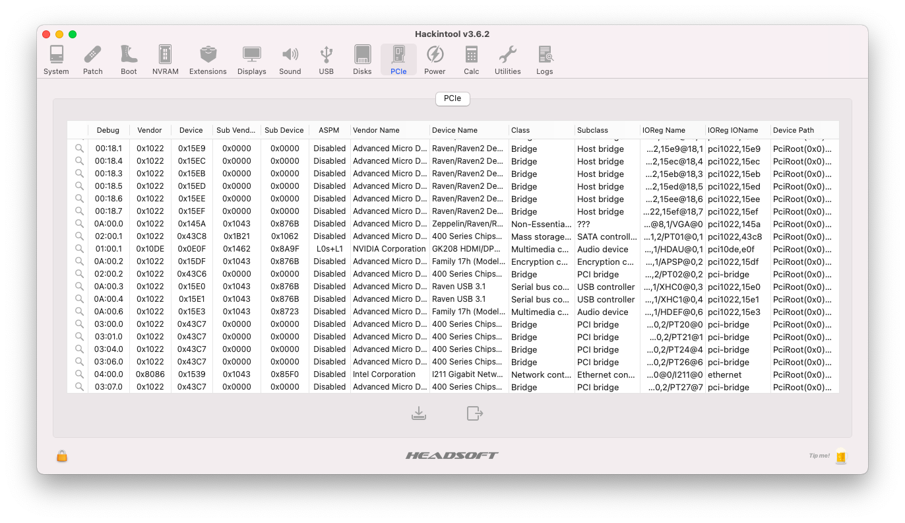

# ASUS ROG Strix B450 F-Gaming Hackintosh

#### *Write this in other language: [English](README.EN.md)* :us:
# Italian Repository 🇮🇹
## macOS Big Sur correttamente installato su ASUS ROG Strix B450 F-Gaming

| Componenti       | Modello                                 |
| ---------------- | ----------------------------------------|
| Scheda Madre     | ASUS ROG Strix B450 F-Gaming            | 
| CPU              | AMD Ryzen™ 3 3200G                      | 
| GPU              | Nvidia GeForce GT 730                   |
| Audio            | Realtek ALCS1220A                       |
| RAM              | 16 Gb DDR4 2666 Mhz                     |
| NVMe             | Samsung SSD 980 500gb                   |
| SMBIOS           | MacPro7,1 (solo se avete Nvidia Kepler) |
| Bootloader       | OpenCore 0.7.4                          |

## Mobo:

## Di default la GUI di OC è impostata in 1920x1080.
Se avete una risoluzione diversa, recatevi in EFI > OC, cancellate la cartella Resources e scompattate quella che vi interessa.

# Impostazioni Bios

## Disabilita:

- Fast Boot
- CSM

## Abilita:

- Above 4G decoding (se non lo trovate nel bios, aggiungete npci=0x2000 nei bootargs)
- EHCI/XHCI Hand-off
- OS type: Other
  
# Dispositivo Screenshot

# Cosa funziona e cosa no:
- [x] Nvidia GeForce GT 730
- [x] ALCS1220A Uscite Jack
- [x] Porte USB (Funzionano parzialmente)
- [x] Intel I211 Gigabit LAN
- [x] NVRAM
- [x] Avvio Windows da OpenCore
- [x] SpeedStep / Sleep / Wake
- [ ] iGPU Vega 8 Graphics

# Extras

AMD Power Gadget: https://github.com/trulyspinach/SMCAMDProcessor/releases

## Cambiare modello CPU in "About This Mac" - macOS Big Sur:

In fase di scrittura...

## Crediti

- [Acidanthera](https://github.com/acidanthera) per OpenCore Bootloader
- [Apple](https://apple.com) per macOS;
- [HackintoshLifeIT](https://github.com/Hackintoshlifeit) Gruppo di supporto pre e post installazione
- [Dortania](https://github.com/dortania) per le guide Hackintosh

# Se avete bisogno di aiuto contattateci su [Telegram](https://t.me/HackintoshLife_it)
